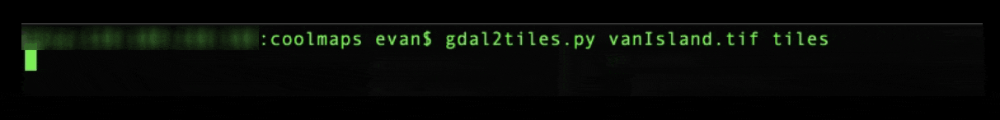
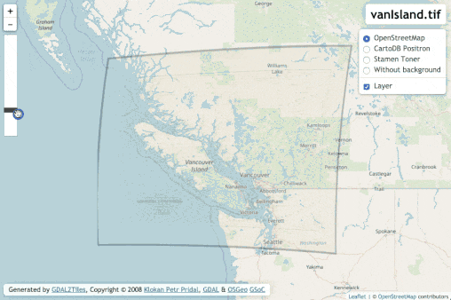

## Create Map Tiles with GDAL

These are the basic steps to complete in order to create a set of map tiles from a georeferenced map. We will use the raster program We'll configure the final web map to have a slide for adjusting the transparency of the overlaid map.


### Software needed
1. GDAL (Geospatial Data Abstraction Library)    **Please install GDAL before the workshop**      
[DOWNLOAD HERE](https://gdal.org/download.html#current-releases)           
2. Internet Browser    


## Other prerequisites
1. Familiarity with (or willingness to try) command line tools.
If you're on a Mac, we'll use Terminal. If on Windows, we'll use the Windows command.
2. A GeoTiff.


## Shell Commands for this tutorial    
#### Basic Commands   
```cd``` - Change working directory      
```ls``` - List the content of the working directory

#### GDAL Commands  
```gdalinfo --version``` - Get the version of your GDAL installation     


# Create some tiles!
Open your command line tool (Cygwin, Terminal, etc.). Let's test out our GDAL installation. In your command line type:   
```gdalinfo --version```

The response should indicate the GDAL version and release date, like:    
```GDAL 2.4.2, released 2019/06/28```     

### Navigate to your GeoTiff

For this example, let's say you're working on a Mac, and have a project folder with the path /Users/evan/Documents/GISprojects/georeferencing/coolmaps/.  

Since my home directory is /Users/evan/, in Terminal I can use the *change directory* (```cd```) command to change my working directory to "coolmaps" by typing this at the command prompt:    
```cd Documents/GISprojects/georeferencing/coolmaps```

*(An alternative method with MacOS is to right click the folder in Finder, and select **Services > New Terminal at Folder**)*    

List the contents of that directory by typing ```ls``` at your command prompt. You should see the name of your GeoTiff or raster image. Mine's called **vanIsland.tif**

### Use gdal2tiles.py to create a tile set
Now that your working directory contains your file, you'll use the gdal2tiles.py script to create map tiles for your map.

The most basic command for this produces a new file directory which contains several folders of tiles, plus a web map template for Google Maps, OpenLayers, and Leaflet. However, there are many options we can add to our command if we need to, and you can find out more in the [gdal2tiles documentation](https://gdal.org/programs/gdal2tiles.html). We need to have gdal2tiles.py create a tileset from an input raster file (vanIsland.tif), and store them in a new file directory (tiles). Gdal2tiles.py will create the new directory for us if it doesn't yet exist with the following command structure:
```gdal2tiles.py [input file] [output directory]   ```

At your command prompt, type:
```gdal2tiles.py vanIsland.tif tiles```

Once executed, you should see the tile creation progress.    



If all goes as planned, this is what you should have in your working directory:
```

├── vanIsland.tif
|
├── tiles
    |
    ├── 5
    |   └── [Tiles at zoom level 5]  
    |  
    ├── 6
    |   └── [Tiles at zoom level 6]  
    |
    ├── 7
    |   └── [Tiles at zoom level 7]  
    |
    ├── 8
    |   └── [Tiles at zoom level 8]  
    |
    ├── 9
    |   └── [Tiles at zoom level 9]  
    |
    ├── 10
    |   └── [Tiles at zoom level 10]  
    |
    ├── googlemaps.html
    |
    ├── leaflet.html
    |
    ├── openlayers.html
    |
    └── tilemapresource.xml
```

# Examine the leaflet.html template!

One of the template .html files that gdal2tiles.py creates is formatted for using LeafletJS. Leaflet is an open source web mapping library that is widely used and documented. First, let's double click to view that it looks like in your internet browser.


Let's examine the file "under the hood":

```html
<!DOCTYPE html>
        <html lang="en">
          <head>
            <meta charset="utf-8">
            <meta name='viewport' content='width=device-width, initial-scale=1.0, maximum-scale=1.0, user-scalable=no' />
            <title>vanIsland.tif</title>

            <!-- Leaflet -->
            <link rel="stylesheet" href="http://cdn.leafletjs.com/leaflet-0.7.5/leaflet.css" />
            <script src="http://cdn.leafletjs.com/leaflet-0.7.5/leaflet.js"></script>

            <style>
                body { margin:0; padding:0; }
                body, table, tr, td, th, div, h1, h2, input { font-family: "Calibri", "Trebuchet MS", "Ubuntu", Serif; font-size: 11pt; }
                #map { position:absolute; top:0; bottom:0; width:100%; } /* full size */
                .ctl {
                    padding: 2px 10px 2px 10px;
                    background: white;
                    background: rgba(255,255,255,0.9);
                    box-shadow: 0 0 15px rgba(0,0,0,0.2);
                    border-radius: 5px;
                    text-align: right;
                }
                .title {
                    font-size: 18pt;
                    font-weight: bold;
                }
                .src {
                    font-size: 10pt;
                }

            </style>

        </head>
        <body>

        <div id="map"></div>

        <script>
        /* **** Leaflet **** */

        // Base layers
        //  .. OpenStreetMap
        var osm = L.tileLayer('http://{s}.tile.osm.org/{z}/{x}/{y}.png', {attribution: '&copy; <a href="http://osm.org/copyright">OpenStreetMap</a> contributors', minZoom: 5, maxZoom: 10});

        //  .. CartoDB Positron
        var cartodb = L.tileLayer('http://{s}.basemaps.cartocdn.com/light_all/{z}/{x}/{y}.png', {attribution: '&copy; <a href="http://www.openstreetmap.org/copyright">OpenStreetMap</a> contributors, &copy; <a href="http://cartodb.com/attributions">CartoDB</a>', minZoom: 5, maxZoom: 10});

        //  .. OSM Toner
        var toner = L.tileLayer('http://{s}.tile.stamen.com/toner/{z}/{x}/{y}.png', {attribution: 'Map tiles by <a href="http://stamen.com">Stamen Design</a>, under <a href="http://creativecommons.org/licenses/by/3.0">CC BY 3.0</a>. Data by <a href="http://openstreetmap.org">OpenStreetMap</a>, under <a href="http://www.openstreetmap.org/copyright">ODbL</a>.', minZoom: 5, maxZoom: 10});

        //  .. White background
        var white = L.tileLayer("data:image/png;base64,iVBORw0KGgoAAAANSUhEUgAAAQAAAAEAAQMAAABmvDolAAAAA1BMVEX///+nxBvIAAAAH0lEQVQYGe3BAQ0AAADCIPunfg43YAAAAAAAAAAA5wIhAAAB9aK9BAAAAABJRU5ErkJggg==", {minZoom: 5, maxZoom: 10});

        // Overlay layers (TMS)
        var lyr = L.tileLayer('./{z}/{x}/{y}.png', {tms: true, opacity: 0.7, attribution: "", minZoom: 5, maxZoom: 10});

        // Map
        var map = L.map('map', {
            center: [50.0091587155, -124.417771355],
            zoom: 10,
            minZoom: 5,
            maxZoom: 10,
            layers: [osm]
        });

        var basemaps = {"OpenStreetMap": osm, "CartoDB Positron": cartodb, "Stamen Toner": toner, "Without background": white}
        var overlaymaps = {"Layer": lyr}

        // Title
        var title = L.control();
        title.onAdd = function(map) {
            this._div = L.DomUtil.create('div', 'ctl title');
            this.update();
            return this._div;
        };
        title.update = function(props) {
            this._div.innerHTML = "vanIsland.tif";
        };
        title.addTo(map);

        // Note
        var src = 'Generated by <a href="http://www.klokan.cz/projects/gdal2tiles/">GDAL2Tiles</a>, Copyright &copy; 2008 <a href="http://www.klokan.cz/">Klokan Petr Pridal</a>,  <a href="http://www.gdal.org/">GDAL</a> &amp; <a href="http://www.osgeo.org/">OSGeo</a> <a href="http://code.google.com/soc/">GSoC</a>';
        var title = L.control({position: 'bottomleft'});
        title.onAdd = function(map) {
            this._div = L.DomUtil.create('div', 'ctl src');
            this.update();
            return this._div;
        };
        title.update = function(props) {
            this._div.innerHTML = src;
        };
        title.addTo(map);


        // Add base layers
        L.control.layers(basemaps, overlaymaps, {collapsed: false}).addTo(map);

        // Fit to overlay bounds (SW and NE points with (lat, lon))
        map.fitBounds([[47.0842205424, -118.879875343], [52.9340968887, -129.955667367]]);

        </script>

        </body>
        </html>

```

## Let's add a transparency slider!
Maybe instead of toggling the layer on and off, we want to have a slider to easily transition between transparency levels. To do this, we can add a script, some styling, and some formatting to our leaflet.html file.    

In the ```<head>``` of our html document, paste the following script:

```javascript
<script>
function init() {

  var handle = document.getElementById('handle'),
    start = false,
    startTop;

  document.onmousemove = function(e) {
    if (!start) return;

  // Adjust control.
  handle.style.top = Math.max(-5, Math.min(195, startTop + parseInt(e.clientY, 10) - start)) + 'px';

  // Adjust opacity.
  lyr.setOpacity(1 - (handle.offsetTop / 200));
    };

  handle.onmousedown = function(e) {

  // Record initial positions.
  start = parseInt(e.clientY, 10);
  startTop = handle.offsetTop - 5;
  return false;
  };
    document.onmouseup = function(e) {
    start = null;
  };
}
</script>
```


And then, in the ```<head>``` and inside the ```<style>```, add the following CSS for the transparency controls:

```CSS
.ui-opacity {
    background:#FFF;
	position:absolute;
	left:10px;
	top:70px;
	height:200px;
    width:26px;
	border:1px solid rgba(0,0,0,0.4);
	border-radius:3px;
	z-index:1000;
}

.ui-opacity .handle {
	position:absolute;
	background:#404040;
	left:0;
	top:20px;
	width:26px;
	height:10px;
	border-radius:1px;
	cursor:pointer;
	cursor:ns-resize;
}

.ui-opacity .handle:hover {
	background:#303030;
}
```

Finally, inside the ```<body>```, just below your map container (```<div id="map"></div>```)
, paste this formatting so that the controls are added to the interface:
```html
<body onload="init()">
<div id='control' class='ui-opacity'>
  <div id='handle' class='handle'></div>
</div>
```
Save your file and refresh your browser. You should see something like this:   


